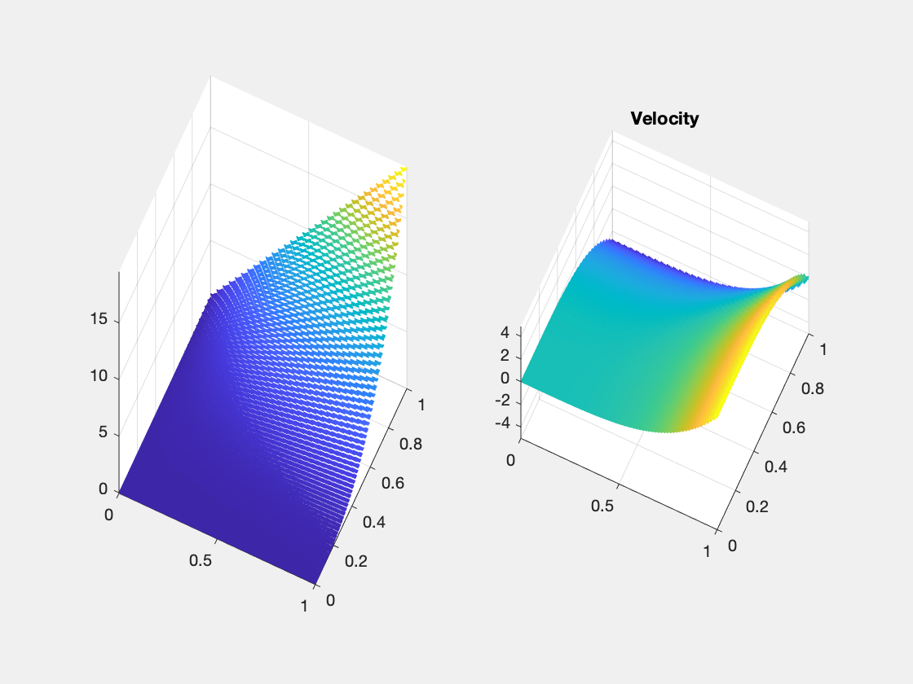
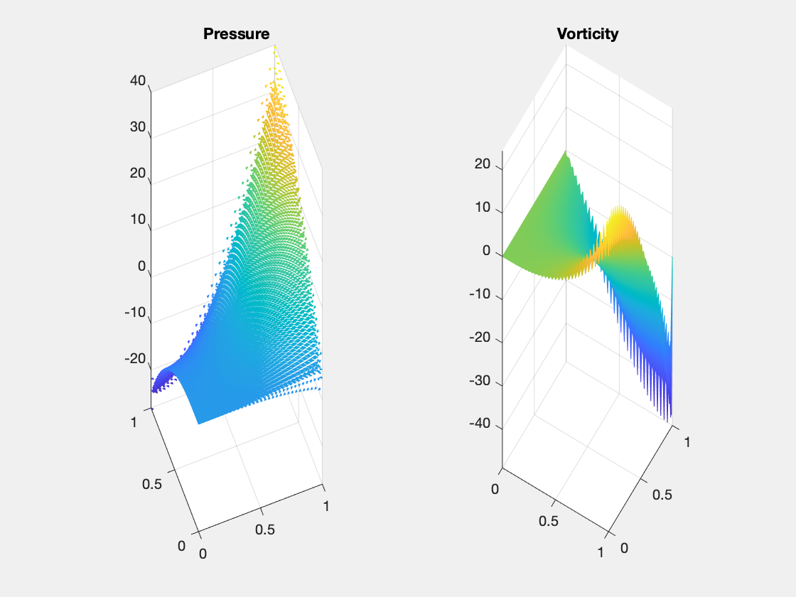

## TMAC for Stokes Equations

This example is to show the rate of convergence of RT0-P0 finite element approximation of the Stokes equations

$$- \Delta u + {\rm grad}\, p  = f \quad {\rm div}\, u    = 0  \quad  \text{ in } \quad \Omega,$$

with the Dirichlet boundary condition:

$$u \cdot t    = g_t   \quad  u \cdot n   = g_n   \text{ in }\;  \Gamma.$$   

The bilinear form used in the discretization is not the standard one for Laplace operator but Hodge Laplace $-\Delta u = {\rm grad\, div}\, u + {\rm curl\, rot} u$

\begin{align}
({\rm rot}_h u_h, {\rm rot}_h v_h) +({\rm div} u_h, {\rm div} v_h).
\end{align}

The quantity $w_h = {\rm rot}_h u_h$ is an approximation of vorticity $w = {\rm rot} u$. Mass lumping is introduced in the computation of $w_h$ so that the formulation only involves $u_h$ and $p_h$. 

In the error table, $(u_h,p_h)$ is the RT0-P0 approximation of velocity and pressure. $u_I$ is the canonical edge interpolant of RT0 element and $p_I$ is the interpolant of p at the barycenter of each triangle. $w = {\rm rot} u$ is the vorticity, $w_h = {\rm rot}_hu_h$ is the numerical approximation and $w_I$ is the Lagrange interpolation of $w$ in P1 finite element space.

**References**:
- [Finite Element Methods For Stokes Equations](http://www.math.uci.edu/~chenlong/226/FEMStokes.pdf)
- [Convergence Analysis of The Triangular MAC Scheme for Stokes Equations](http://www.math.uci.edu/~chenlong/226/TMAC.html)

**Subroutines**:

    - StokesRT0
    - squareStokes
    - femStokesHdiv
    - StokesRT0femrate
    
The method is implemented in `StokesRT0` subroutine and can be tested in `squareStokes`. Together with other elements (BDM), `femStokesHdiv` provides a concise interface to solve Stokes equation using Hdiv elements. The RT0-P0 element is tested in `StokesRT0femrate`. This doc is also based on `StokesRT0femrate`.

See also
 
      StokesBDM1bfemrate    

## (RT0,P0,P1) Element

The velocity is RT0 element and the pressure is P0 element. The vorticity is P1 element. 

We list the basis for RT0 below and refer to [PoissonRT0femrate](PoissonRT0mfemrate.html) for data structure. 


### Local bases of RT0 element

Suppose `[i,j]` is the k-th edge. The two dimensional curl is a rotated graident defined as $\nabla^{\bot} f = (-\partial_y f, \partial _x f).$ The basis of this edge along with its divergence are given by

$$ \phi_k = \lambda_i \nabla^{\bot} \lambda_j - \lambda_j \nabla^{\bot} \lambda_i. $$

Inside one triangular, the 3 bases corresponding to 3 local edges `[2 3; 1 3; 1 2]` are:

$$ \phi_1 = \lambda_2 \nabla^{\bot} \lambda_3 - \lambda_3 \nabla^{\bot} \lambda_2. $$ 

$$ \phi_2 = \lambda_1 \nabla^{\bot} \lambda_3 - \lambda_3 \nabla^{\bot} \lambda_1. $$

$$ \phi_3 = \lambda_1 \nabla^{\bot} \lambda_2 - \lambda_2 \nabla^{\bot} \lambda_1. $$

The 3 dual bases are the line integral over orientated edges

$$l_i(u) = \int_{e_i} u \cdot n_i \, ds,$$

where $n_i = t_i^{\bot}$ is the rotation of the unit tangential vector of $e_i$ by $90^{\deg}$ counterclockwise.

It is straightforward to verify the "orthogonality":
$$l_i(\phi_j) = \delta_{ij}.$$

## Example 1: Unit square with bisection grids


```matlab
clear variables; 
close all;
% setup
[node,elem] = squaremesh([0,1,0,1],0.5);
pde = Stokesdata1; % zero Dirichlet boundary condition
bdFlag = setboundary(node,elem,'Dirichlet');
mesh = struct('node',node,'elem',elem,'bdFlag',bdFlag);
% option
option.L0 = 1;
option.elemType = 'RT0-P0';
option.maxIt = 4;
option.solver = 'mg';
option.refType = 'bisect';
option.viewanglep = [-21,88];
option.viewanglew = [31,88];
% fem
femStokesHdiv(mesh,pde,option);
```

    #dof:    304,  #nnz:   5384, level:  2  MG WCYCLE iter:  8,  err = 4.5768e-09,  time = 0.014 s
    #dof:   1248,  #nnz:  25112, level:  3  MG WCYCLE iter:  8,  err = 2.0996e-09,  time = 0.023 s
    #dof:   5056,  #nnz: 107960, level:  4  MG WCYCLE iter:  8,  err = 2.2802e-09,  time = 0.068 s
    #dof:  20352,  #nnz: 447224, level:  5  MG WCYCLE iter:  8,  err = 2.2515e-09,  time = 0.24 s
    Table: Error
     #Dof       h     ||u_I-u_h||_1   ||u-u_h||   ||u_I-u_h||_{max}
    
      336   1.25e-01   3.65267e+00   8.15864e-01   6.23566e-02
     1312   6.25e-02   3.89881e+00   4.06509e-01   1.74258e-02
     5184   3.12e-02   4.02165e+00   2.02844e-01   4.57156e-03
    20608   1.56e-02   4.08195e+00   1.01315e-01   1.16885e-03
    
     #Dof       h      ||p_I-p_h||    ||p-p_h||   ||p_I-p_h||_{max}||p_I - p^r_h||
    
      336   1.25e-01   1.67537e+00   2.17524e+00   1.08659e+01   1.27166e+00
     1312   6.25e-02   9.87263e-01   1.20769e+00   8.65984e+00   3.91019e-01
     5184   3.12e-02   6.52459e-01   7.39582e-01   7.21539e+00   1.20847e-01
    20608   1.56e-02   4.49873e-01   4.82431e-01   6.80094e+00   4.57294e-02
    
     #Dof       h      ||w_I-w_h||    ||w-w_h||   
    
      336   1.25e-01   3.27192e+00   2.04257e+00
     1312   6.25e-02   1.88237e+00   1.13439e+00
     5184   3.12e-02   1.16284e+00   6.85950e-01
    20608   1.56e-02   7.57668e-01   4.42065e-01
    
    Table: CPU time
     #Dof   Assemble     Solve      Error      Mesh    
    
      336   1.00e-02   1.40e-02   1.00e-02   0.00e+00
     1312   0.00e+00   2.31e-02   2.00e-02   0.00e+00
     5184   1.00e-02   6.76e-02   7.00e-02   0.00e+00
    20608   1.10e-01   2.43e-01   2.50e-01   0.00e+00
    


    

    


    

    


    

    


For bisection grids, only half order for vorticity and pressure. It is
interesting to note that the energy norm $|u_I - u_h|_1$ doesn't converge
due to the loss of consistency $\| {\rm rot}\, u - {\rm rot}_h \,u_I \|$ for the standard
edge interpolant. Also no convergence of the maximum norm for pressure at the
barycenter. It is observed vorticity oscillates on the boundary.


## Example 2: Unit square with regular grids


```matlab
clear variables; 
close all;
% setup
[node,elem] = squaremesh([0,1,0,1],0.5);
pde = Stokesdata1;  % non-zero Dirichlet boundary condition
bdFlag = setboundary(node,elem,'Dirichlet');
mesh = struct('node',node,'elem',elem,'bdFlag',bdFlag);
% option
option.L0 = 1;
option.elemType = 'RT0-P0';
option.maxIt = 4;
option.solver = 'mg';
option.printlevel = 1;
option.refType = 'red';
option.viewanglep = [-21,88];
option.viewanglew = [31,88];
% fem
femStokesHdiv(mesh,pde,option);
```

    #dof:    304,  #nnz:   3722, level:  2  MG WCYCLE iter:  7,  err = 6.7054e-09,  time = 0.043 s
    #dof:   1248,  #nnz:  17210, level:  3  MG WCYCLE iter:  7,  err = 7.2926e-09,  time = 0.033 s
    #dof:   5056,  #nnz:  73754, level:  4  MG WCYCLE iter:  7,  err = 7.0585e-09,  time = 0.06 s
    #dof:  20352,  #nnz: 305114, level:  5  MG WCYCLE iter:  7,  err = 6.0617e-09,  time = 0.17 s
    Table: Error
     #Dof       h     ||u_I-u_h||_1   ||u-u_h||   ||u_I-u_h||_{max}
    
      336   1.25e-01   5.15626e-01   9.32105e-01   1.13247e-02
     1312   6.25e-02   2.49107e-01   4.68316e-01   2.15673e-03
     5184   3.12e-02   1.04102e-01   2.34417e-01   3.60125e-04
    20608   1.56e-02   4.04527e-02   1.17239e-01   5.36428e-05
    
     #Dof       h      ||p_I-p_h||    ||p-p_h||   ||p_I-p_h||_{max}||p_I - p^r_h||
    
      336   1.25e-01   1.29413e+00   1.90145e+00   1.17057e+01   1.42268e+00
     1312   6.25e-02   5.01835e-01   8.58964e-01   9.07722e+00   4.95102e-01
     5184   3.12e-02   1.99327e-01   4.01565e-01   7.26445e+00   1.74510e-01
    20608   1.56e-02   8.63987e-02   1.94542e-01   6.19933e+00   6.78577e-02
    
     #Dof       h      ||w_I-w_h||    ||w-w_h||   
    
      336   1.25e-01   3.08967e+00   2.21436e+00
     1312   6.25e-02   1.51963e+00   1.08270e+00
     5184   3.12e-02   7.55491e-01   5.35842e-01
    20608   1.56e-02   3.77219e-01   2.67015e-01
    
    Table: CPU time
     #Dof   Assemble     Solve      Error      Mesh    
    
      336   1.00e-02   4.32e-02   2.00e-02   0.00e+00
     1312   1.00e-02   3.26e-02   1.00e-02   0.00e+00
     5184   1.00e-02   5.95e-02   4.00e-02   1.00e-02
    20608   3.00e-02   1.67e-01   1.90e-01   1.00e-02
    


    

    


    

    


    

    


The same seeting except the refinement rule is changed to the red refinement. For the red refinement grids and zero Dirichlet boundary condition, first order convergence for vorticity (although it still contains peaks at corners), and discrete pressure error (i.e. comparing to the interpolant p_I) is observed. It produces much better approximation. 

## Conclusion

The rate of convergence of RT0-P0 depends crucially on the symmetry of
the grids. For general unstructured grids, only half order for vorticity
(consequently velocity in the energy norm) and pressure can be obtained. When the grid satisfies
the approximately parallegram property, optimal first order is recovered.

Change the method to BDM1b-P0 will lead to optimal order of
convergence on general unstructured grids. See [StokesBDM1bfemrate](StokesBDM1bfemrate.html).

Multigrid solver based on DGS smoother converges uniformly. 


```matlab

```
