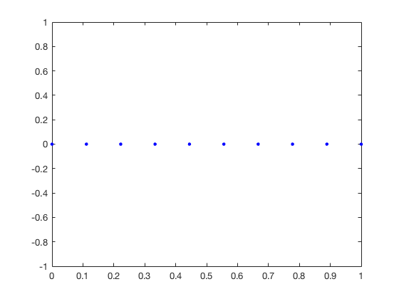

# Project: 1-D Finite Difference Method

The purpose of this project is to introduce the finite difference method for solving differential equations in 1-D. Consider 1-D Poisson equation in $(0,1)$ with Dirichlet boundary condition

$$ - u'' = f \,\; {\rm in }\, (0,1), \quad u(0) = a, u(1) = b. $$

## Step 1: Generate a grid

Generate a vector representing a uniform grid with size `h` of (0,1).


```matlab
N = 10;
x = linspace(0,1,N);
plot(x,0,'b.','Markersize',16)
```


    

    


## Step 2: Generate A Matrix Equation

Based on a grid, the function $u$ is discretized by a vector `u`. The
derivative $u', u''$ are approximated by centeral finite difference:

$$ u'(x_i) \approx \frac{u(i+1) - u(i-1)}{2h}$$

$$ u''(x_i) \approx \frac{u(i-1) - 2u(i) + u(i+1)}{h^2}$$ 

The equation $-u''(x) = f(x)$ is discretized at $x_i, i=1,...,N$ as

$$ \frac{-u(i-1) + 2u(i) - u(i+1)}{h^2} \quad = f(i),$$

where $f(i) = f(x_i)$. These linear equations can be written as a matrix
equation `A*u = f`, where `A` is a tri-diagonal matrix `(-1,2,-1)/h^2`.


```matlab
n = 5;
e = ones(n,1);
A = spdiags([e -2*e e], -1:1, n, n);
display(full(A));
```

    
    ans =
    
        -2     1     0     0     0
         1    -2     1     0     0
         0     1    -2     1     0
         0     0     1    -2     1
         0     0     0     1    -2
    


We use `spdiags` to speed up the generation of the matrix since the matrix is sparse. Compare `diag` and `spdiags`.

## Stpe 3: Modify the Matrix Equation to Impose Boundary Conditions

The discretization fails at boundary vertices since no nodes outside the
interval. Howevery the boundary value is given by the problem: `u(1) = a,
u(N) = b`.

These two equations can be included in the matrix by changing `A(1,:) =
[1, 0 ..., 0]` and `A(:,N) = [0, 0, ..., 1]` and `f(1) = a/h^2, f(N) =
b/h^2`.


```matlab
A(1,1) = 1;
A(1,2) = 0;
A(n,n) = 1;
A(n,n-1) = 0;
display(full(A));
```

    
    ans =
    
         1     0     0     0     0
         1    -2     1     0     0
         0     1    -2     1     0
         0     0     1    -2     1
         0     0     0     0     1
    


## Step 4: Test the Correctness 

    [u,x] = poisson1D(0,1,5);
    plot(x,sin(x),x,u,'r*');
    legend('exact solution','approximate solution')

Choose an exact solution $u=\sin(x)$ and run your code to show the computed solution fits well on the curve of the true solution.

## Step 5: Check the Convergence Rate

    err = zeros(4,1);
    h = zeros(4,1);
    for k = 1:4
        [u,x] = poisson1D(0,1,2^k+1);
        uI = sin(x);
        err(k) = max(abs(u-uI));
        h(k) = 1/2^k;
    end
    display(err)
    loglog(h,err,h,h.^2);
    legend('error','h^2');
    axis tight;
    
Change mesh size and show the convergence rate is second order, i.e. $h^2$.    
