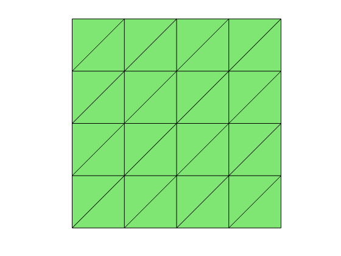
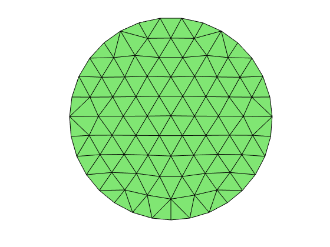

# Project: Linear Finite Element Methods

 The purpose of this project is to implement the finite element method for
 solving the Poisson equation in a general polygonal domain using
 the piecewise linear finite element. 

## Step 1: Download and Install iFEM

- Download [iFEM](https://bitbucket.org/ifem/ifem/get/tip.zip).
- Unzip the file to where you like.
- In MATLAB, go to the iFEM folder . 
- Run `setpath.m`.

## Step 2: Mesh


```matlab
% Generate mesh for the unit square
[node,elem] = squaremesh([0,1,0,1],0.25);
showmesh(node,elem);
```


    

    


```matlab
% Generate mesh for the unit disk
[node,elem] = circlemesh(0,0,1,0.2);
showmesh(node,elem);
```

     - Min quality 0.7570 - Mean quality 0.9696 - Uniformity 4.34% 


    

    


```matlab
% Uniformly refine it to get a finer mesh
[node,elem] = uniformrefine(node,elem);
showmesh(node,elem);
```


    

    


## Step 3: Assembling the matrix

Compare three ways of assembling the stiffness matrix discussed in [Progamming of Finite Element Methods](http://www.math.uci.edu/~chenlong/226/Ch3FEMCode.pdf).

Record the time by

    tic; assemblingstandard; toc;
    tic; assemblingsparse; toc;
    tic; assembling; toc;

Compare the computational time for different `N` by applying the uniform refinement of the initial mesh several times. Try to test the assembling until `N > 5*1e^4`.

## Step 4: Right hand side

Using three points quadrature (i.e. 3 middle points of a triangle) to
compute the right hand side vector.

## Step 5: Boundary conditions

* Use `findboundary.m` to get all boundary nodes and edges
* Code pure Dirichlet boundary condition $u = g_D$
* Code pure Neumann boundary condition $\nabla u\cdot n = g_N$
* (*optional*) Code Robin boundary condition $u + d\nabla u\cdot n = g_R$

## Step 6: Verify convergence

- Choose a smooth solution, say $u = \sin(2\pi x)\cos(2\pi y)$, calculate the right hand side $f$ and boundary conditions for the unit square. 

- Use your subroutine to get an approximation and use `showresult` to plot the mesh and the solution.

- Use `uniformrefine` to refine the mesh and compute a sequence of solutions.

- Compute the error in H1 norm and L2 norm using `getH1error` and
`getL2error`.

- Using the stiffness matrix to compute the error $\|\nabla(u_I - u_h)\|$, where $u_I$ is the nodal interpolation.

- Use `showrateh` to plot the rate of convergence of these error.

- Test both Dirchlet and Neumann problems.

## Step 7: A challenging problem

Code your subroutine in a general way such that you can solve the Poisson equation on a different mesh by changing the input arguments. 

After you get the desireable results for the unit square, try to solve $-\Delta u = 1$ with constant Neumann boundary conditions on the unit disk. The exact solution can be found using the polar coordinate.
